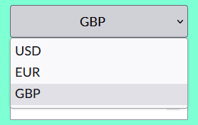
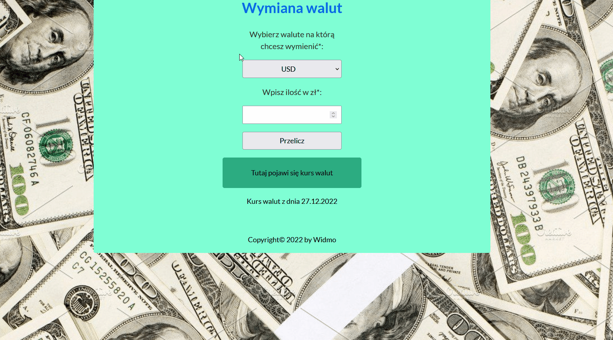

# currency-conventer

## About Project
It is my second project on github.
It's a simple currency calculator 

## How to use
1. Enter the amount you want to exchange

2. Select the currency you want to convert to

3. Click button "Przelicz"

## Demo
https://michalwodniczak.github.io/currency-conventer/

## Featuer
1. HTML
2. CSS
3. Javascript
4. Convention - BEM

## Contact
https://github.com/michalwodniczak
